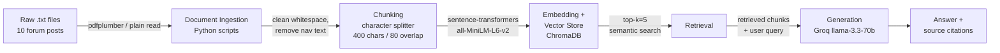

# Project 1 Planning: The Unofficial Guide

> Write this document before you write any pipeline code.
> Your spec and architecture diagram are what you'll use to direct AI tools (Claude, Copilot, etc.) to generate your implementation — the more specific they are, the more useful the generated code will be.
> Update the Retrieval Approach and Chunking Strategy sections if you change your approach during implementation.
> Update this file before starting any stretch features.

---

## Domain

<!-- What domain did you choose? Why is this knowledge valuable and hard to find through official channels? -->

New Grad SWE Interview Experiences — covering technical (LeetCode, system design) and behavioral rounds at top companies.
This knowledge is valuable because official company career pages only describe the process generically. The real signal — what topics actually appear, how interviewers evaluate answers, which behavioral themes recur — lives in candidate experience posts scattered across Blind, Reddit, Glassdoor, and LeetCode discuss. There's no single place to search "what does Capital One TDP actually test in system design."

---

## Documents

<!-- List your specific sources: URLs, subreddit names, forum threads, or file descriptions.
     Aim for at least 10 sources that together cover different subtopics or perspectives within your domain. -->

| #   | Source    | Description                                    | URL or location                                                                                  |
| --- | --------- | ---------------------------------------------- | ------------------------------------------------------------------------------------------------ |
| 1   | Blind     | "Bloomberg interview process"                  | https://www.teamblind.com/post/bloomberg-interview-process-ymx04b5i                              |
| 2   | Blind     | "Bloomberg new grad interview"                 | https://www.teamblind.com/post/bloomberg-new-grad-interview-dvxpnaes                             |
| 3   | Blind     | "Bloomberg Interview Process"                  | https://www.teamblind.com/post/bloomberg-interview-process-jypvloej                              |
| 4   | Reddit    | "Apple SWE New Grad Technical Interview"       | https://www.reddit.com/r/csMajors/comments/1ohnn13/apple_swe_new_grad_technical_interview/       |
| 5   | Reddit    | "Apple New Grad Interview Expectations?"       | https://www.reddit.com/r/FAANGrecruiting/comments/1otr1bf/apple_new_grad_interview_expectations/ |
| 6   | Reddit    | "Apple new grad SWE role"                      | https://www.reddit.com/r/leetcode/comments/1m7j1pm/apple_new_grad_swe_role/                      |
| 7   | Leetcode  | "Cracked Google - interview experience L3"     | https://leetcode.com/discuss/post/8324412/cracked-google-interview-experience-l3-b-xgeq/         |
| 8   | Leetcode  | "L3 Team matching (Google)"                    | https://leetcode.com/discuss/post/8256291/l3-team-matching-by-anonymous_user-4ouh/               |
| 9   | Glassdoor | "Software Engineer Graduate Interview(Amazon)" | https://www.glassdoor.com/Interview/Amazon-Interview-E6036-RVW103632134.htm                      |
| 10  | Glassdoor | "Graduate Software Engineer Interview(Amazon)" | https://www.glassdoor.com/Interview/Amazon-Interview-E6036-RVW104015185.htm                      |
| 11  | Glassdoor | "Graduate Software Engineer Interview(Amazon)" | https://www.glassdoor.com/Interview/Amazon-Interview-E6036-RVW104302774.htm                      |

---

## Chunking Strategy

<!-- How will you split documents into chunks?
     State your chunk size (in tokens or characters), overlap size, and explain why those
     numbers fit the structure of your documents.
     A review-heavy corpus warrants different chunking than a long FAQ. -->

## Chunking Strategy

**Chunk size:** 400 characters

**Overlap:** 80 characters

**Reasoning:**  
These documents are forum posts and reviews — short, opinion-dense paragraphs where
a single sentence often carries the key fact (e.g., "3 technical rounds, all LC mediums,
no system design"). A large chunk size (e.g., 1000+ characters) would bundle unrelated
facts together, making it harder to retrieve the specific answer to a narrow query.
400 characters is roughly 2–4 sentences, which typically captures one coherent idea
(a round description, a piece of advice, or a topic warning) without splitting it.

An overlap of 80 characters (~half a sentence) ensures that facts sitting at a chunk
boundary — for example, a round description that starts at the end of one chunk —
still appear in the next chunk and remain retrievable. Without overlap, a query about
"Bloomberg behavioral round" could miss a chunk where "behavioral" appears in the
last line and the substance is in the next.

Chunks that are too small (e.g., 100 characters) would isolate single sentences with
no context, making it hard for the LLM to generate a coherent answer. Chunks that are
too large would dilute the semantic signal, returning chunks that contain the right
company name but the wrong topic.

---

## Retrieval Approach

<!-- Which embedding model are you using (e.g., all-MiniLM-L6-v2 via sentence-transformers)?
     How many chunks will you retrieve per query (top-k)?
     If you were deploying this for real users and cost wasn't a constraint, what tradeoffs
     would you weigh in choosing a different embedding model — context length, multilingual
     support, accuracy on domain-specific text, latency? -->

**Embedding model:** `all-MiniLM-L6-v2` via `sentence-transformers`

**Top-k:** 5

**Production tradeoff reflection:**  
`all-MiniLM-L6-v2` is fast, free, and runs locally with no API key or rate limits,
making it practical for this project. For a production system with real users,
I would weigh the following tradeoffs:

- **Context length:** MiniLM handles up to 256 tokens, which fits individual forum
  posts well. For longer documents (e.g., full interview guides), a model with longer
  context like `text-embedding-3-large` (OpenAI) would reduce information loss from
  truncation.
- **Domain accuracy:** MiniLM is a general-purpose model not fine-tuned on
  interview or tech career text. A domain-specific model or fine-tuned variant could
  produce better semantic matches for jargon like "Power Day," "Googleyness," or
  "LC tagged questions."
- **Multilingual support:** Not a concern for this corpus (all English), but relevant
  for a global student audience — models like `paraphrase-multilingual-MiniLM-L12-v2`
  would be needed.
- **Latency vs. accuracy:** Local inference with MiniLM is fast but less accurate
  than API-based models. In production, the cost of an OpenAI embedding call (~$0.0001
  per query) is likely worth the accuracy gain.

Top-k = 5 balances giving the LLM enough context to synthesize an answer (more than
1–2 chunks) without flooding the prompt with irrelevant content. For cross-company
questions (e.g., "what advice appears across all companies"), I may increase to k=8.

---

## Evaluation Plan

<!-- List your 5 test questions with their expected correct answers.
     Questions should be specific enough that you can judge whether the system's response
     is right or wrong. "What are good dining halls?" is too vague.
     "What do students say about wait times at [dining hall name] during lunch?" is testable. -->

| #   | Question                                                                                                         | Expected answer                                                                                                                                                                                                         |
| --- | ---------------------------------------------------------------------------------------------------------------- | ----------------------------------------------------------------------------------------------------------------------------------------------------------------------------------------------------------------------- |
| 1   | What is the full interview format for Bloomberg new grad SWE, and how many rounds are there?                     | Phone screen → 2–3 technical rounds (LC mediums, no system design) → 1 behavioral round → 1 engineering manager round (resume/technical deep dive). ~5 rounds total.                                                    |
| 2   | Does the Bloomberg new grad interview include system design?                                                     | Mostly no — multiple candidates report all-LC format with no system design, though at least one report mentions it was included. The dominant experience is LC-only.                                                    |
| 3   | What types of coding questions appear in Google L3 new grad interviews, and what is the difficulty level?        | Graph problems (medium and hard), topological sort, array/matrix questions. Difficulty ranges from medium to hard. Interviewers observe problem-solving approach even on unsolvable follow-ups.                         |
| 4   | What does the Amazon new grad interview process consist of at the assessment stage?                              | A HackerRank online assessment with one easy and one medium-hard LeetCode-style question, followed by an Amazon Work Style Assessment (behavioral/personality questions).                                               |
| 5   | What is the most commonly shared advice for new grad SWE interviews across Bloomberg, Apple, Google, and Amazon? | Focus on LeetCode mediums (especially company-tagged problems), practice explaining your thought process clearly, and prepare behavioral stories using STAR format. System design is rarely required at new grad level. |

---

## Anticipated Challenges

<!-- What could go wrong? Name at least two specific risks with reasoning.
     Consider: noisy or inconsistent documents, missing source attribution, off-topic
     retrieval, chunks that split key information across boundaries. -->

1.**Thin documents for Google and Amazon:** Doc 7 and Doc 8 (Google LeetCode posts)
contain very little body text — the LeetCode Discuss pages only rendered a timeline
and a short question with no comments loaded. Doc 9 and Doc 10 (Glassdoor) require
login to see full content. This means retrieval for Google and Amazon queries may
return low-signal chunks, causing the LLM to either hallucinate or fall back to
generic answers. Mitigation: manually copy full post content including comments
into the `.txt` files before ingestion.

2.**Cross-chunk key facts:** Many critical facts in forum posts span two sentences —
e.g., "I had 5 rounds. The first 3 were technical, the last 2 were behavioral and
EM." If the chunk boundary splits after "5 rounds," neither chunk independently
answers "how many technical rounds." The 80-character overlap partially mitigates
this, but some boundary splits will still lose context. This is a known failure mode
to document in the evaluation report.

---

## Architecture

<!-- Draw a diagram of your pipeline showing the five stages:
     Document Ingestion → Chunking → Embedding + Vector Store → Retrieval → Generation
     Label each stage with the tool or library you're using.
     You can use ASCII art, a Mermaid diagram, or embed a sketch as an image.
     You'll use this diagram as context when prompting AI tools to implement each stage. -->

---

## AI Tool Plan

<!-- For each part of the pipeline below, describe:
     - Which AI tool you plan to use (Claude, Copilot, ChatGPT, etc.)
     - What you'll give it as input (which sections of this planning.md, which requirements)
     - What you expect it to produce
     - How you'll verify the output matches your spec

     "I'll use AI to help me code" is not a plan.
     "I'll give Claude my Chunking Strategy section and ask it to implement chunk_text()
     with my specified chunk size and overlap" is a plan. -->

**Milestone 3 — Ingestion and chunking:**
I will give Claude my Chunking Strategy section (chunk size: 400, overlap: 80) and
the structure of my `.txt` files, and ask it to implement `ingest.py` containing:

- A `load_documents(folder_path)` function that reads all `.txt` files and returns
  a list of dicts with `{text, source, url}`
- A `chunk_text(text, chunk_size=400, overlap=80)` function using character splitting
  I will verify the output by printing chunk count and first 3 chunks for one document
  and checking they match my expected size and overlap.

**Milestone 4 — Embedding and retrieval:**
I will give Claude my Retrieval Approach section (model: all-MiniLM-L6-v2, top-k: 5)
and ask it to implement `retrieval.py` containing:

- `embed_and_store(chunks)` — embeds chunks and stores them in a local ChromaDB
  collection with source metadata
- `query(question, k=5)` — takes a plain-language question and returns the top-k
  chunks with their source attribution
  I will verify by running my 5 evaluation questions against the retriever alone
  (before adding generation) and checking that returned chunks are topically relevant.

**Milestone 5 — Generation and interface:**
I will give Claude my full pipeline spec and ask it to implement `generate.py`
containing a `answer(question)` function that: (1) calls `query()` to retrieve
top-k chunks, (2) builds a prompt instructing the LLM to answer only from provided
context and cite sources, (3) calls the Groq API with `llama-3.3-70b-versatile`,
and (4) returns the answer with source document names appended.
I will verify by checking that responses for my 5 evaluation questions reference
specific document sources and do not contain information absent from retrieved chunks.
